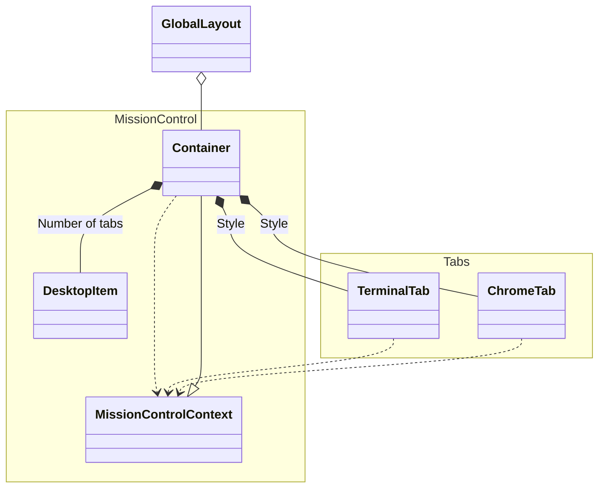

| Type      | Description                                                     |
| --------- | --------------------------------------------------------------- |
| A <\|-- B | A 컴포넌트가 B 구현에 사용됨 (Inheritance)                      |
| A \*-- B  | B 컴포넌트에서 Props를 받으며 A 컴포넌트가 호출됨 (Composition) |
| A o-- B   | B 컴포넌트에서 A 컴포넌트가 호출됨 (Aggregation)                |
| A --> B   | A 컴포넌트에서 B State에 접근 (Association)                     |
| A ..> B   | A 컴포넌트에서 B State에 접근/제어 (Dependency)                 |
| A -- B    | A, B 컴포넌트에서 서로의 State에 접근 {Link (Solid)}            |
| A .. B    | A, B 컴포넌트에서 서로의 B State에 접근/제어 {Link (Dashed)}    |

[More](https://github.com/syi0808/WhoAmI/blob/main/class-diagram.md)

